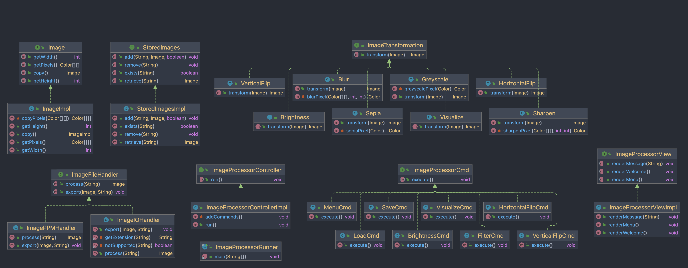

# Image Processor

_Smita Rosemary and Ben Bishop – CS3500 Fall 2022, Northeastern University_

## Overview

This project represents an Image Processor that allows you to manipulate and enhance a given image.

The Image Processor allows a user to load in Image into the program, save it, and apply
transformations such as:

* Visualizing the red, blue, green, alpha, luma, or intensity channels of each pixel in an image as
  a greyscale image
* Vertically or horizontally flipping an image
* Brightening or darkening an image

The user interacts with the Image Processor through the command line interface (CLI) and can load
images into the processor, apply transformations, and save transformed images. Currently only `.ppm`
files are supported.

## How to Use

Upon launch, the user will be shown a welcome message, with the option to "quit" the program or view
a "menu" of available commands. The user can enter the command `quit` at any time to exit the
program.

**All available commands are listed below:**

* "quit" - _quits the program_
* "menu" - _displays the menu of commands_
* "load" <path> <filename> - _loads an image (identified by given name) into the processor_
* "save" <path> <filename> - _saves an image to an output file_
* "visualize-`<component>`" `<filename>` `<new filename>` - _transforms an image to a new greyscale
  image using a chosen component_
    * `<component>` can be "red", "green", "blue", "value", "intensity", or "luma"
* "brighten" `<amount>` `<filename>` `<new filename>` - _transforms an image to a new image
  brightened by an amount_
* "darken" `<amount>` `<filename>` `<new filename>` - _transforms an image to a new image darkened
  by an amount_
* "horizontal-flip" `<filename>` `<new filename>` - _horizontally flips an image to a new image_
* "vertical-flip" `<filename>` `<new filename>` - _vertically flips an image to a new image_

We have provided a test image located in the `res` folder named `ExampleImage.ppm`. We have also
processed this image with all available commands to visualize transformations without running the
program and saved them to the subfolder `res/processed`. `ExampleImage.ppm` was created by Smita
Rosemary, and has been used with her permission.

## Class Overview

### Controller

* Interfaces
    * `ImageProcessorController` : Represents a controller for the image processor. As the user
      inputs commands, the controller validates the parameters and executes them. The controller
      also handles the exceptions thrown by the model and view, and displays them as messages to the
      user via the view.
        * Implementations:
            * `ImageProcessorControllerImpl`: Implements the `ImageProcessorController` interface
              supporting the above transformation commands as well as `load`, `menu`, and `save`.
    * `ImageProcessorCmd` : Represents a supported command that the image processor can handle. The
      command is executed by calling the `execute` method, and implemented subclasses of this
      interface will handle the execution of the command
        * Implementations:
            * `LoadCmd` : Implements the `ImageProcessorCmd` and represents the `load` command
              offered by the processor.
                * `MenuCmd` : Implements the `ImageProcessorCmd` and represents the `menu` command
                  offered by the processor.
                * `SaveCmd` : Implements the `ImageProcessorCmd` and represents the `save` command
                  offered by the processor.
                * `BrightnessCmd` : Implements the `ImageProcessorCmd` and represents the `brighten`
                  and `darken`
                  command offered by the processor.
                * `HorizontalFlipCmd` : Implements the `ImageProcessorCmd` and represents
                  the `horizontal-flip`
                  command offered by the processor.
                * `VerticalFlipCmd` : Implements the `ImageProcessorCmd` and represents
                  the `vertical-flip` command offered by the processor.
                * `VisualizeCmd` : Implements the `ImageProcessorCmd` and represents
                  the `visualize-<componenet>`
                  command offered by the processor.
    * `ImageFileHandler` :  Represents a model used to convert image files into `Image` objects.
        * Implementations:
            * `ImagePPMHandler` : Implements the `ImageFileHandler` interface for converting PPM
              image files into `Image` objects, and vice versa.

### Model

* Interfaces
    * `Image` : Represents an image and it's pixels.
        * Implementations:
            * `ImageImpl` : Implements the `Image` interface, each image is represented by a 2D
              array of colors.
    * `ImageTransformation` : Represents a macro that can be applied to an `Image` to transform its
      pixels in some way.
        * Implementations:
            * `Brightness` : Implements the `ImageTransformation` interface and represents a macro
              that adjusts the brightness of an image, both up the scale and down.
                * `HorizontalFlip` : Implements the `ImageTransformation` interface and represents a
                  macro that flips an image along the horizontal axis.
                * `VerticalFlip`: Implements the `ImageTransformation` interface and represents a
                  macro that flips an image along the vertical axis.
                * `Visualize` : Implements the `ImageTransformation` interface and represents a
                  macro that transforms the images to visualize the greyscale image by one of the
                  following color components : `visualize-red`, `visualize-blue`, `visualize-green`
                  , `visualize-value`,
                  `visualize-intensity`, `visualize-luma`.

    * `StoredImages` : Represents a collection of  `Image`s that have been loaded into the program
      by the user, identified by the image's file name selected by the user.
        * Implementations:
            * StoredImagesImpl` : Implements the `StoredImages` interface. The stored images are
              represented by a Map<String, Image>, the string representing a fileName.

### View

* Interfaces
    * `ImageProcessorView` : This interface represents the view of the Image Processor. It contains
      methods that the controller can call to render the view.
        * Implementations:
            * `ImageProcessorViewImpl` : Implements the ImageProcessorView interface and it's
              methods. Handles appending all the messages from the controller to the user.

### Main Class

* `ImageProcessorRunner` :  Contains the main method which runs the image processor in the terminal
  for the user.

## Class Diagram

To more easily visualize these classes, we have provided a class diagram below:

